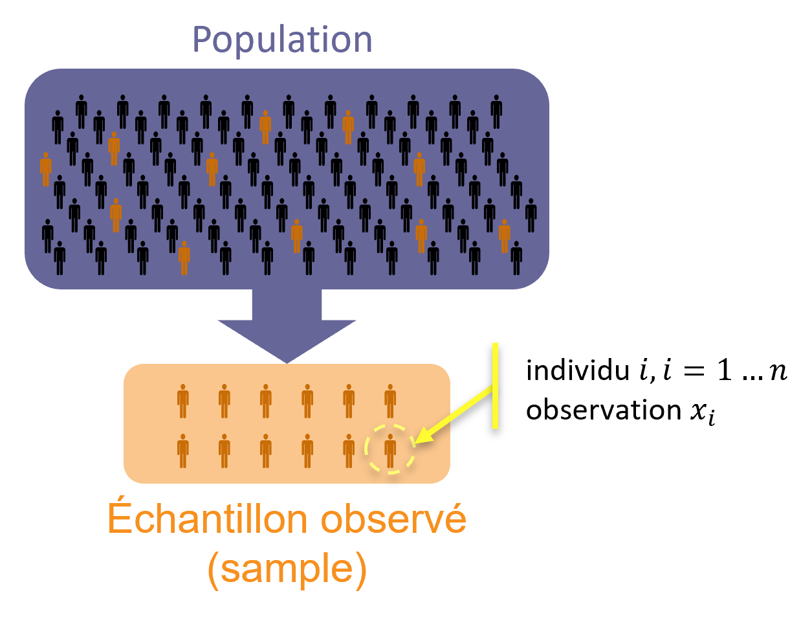
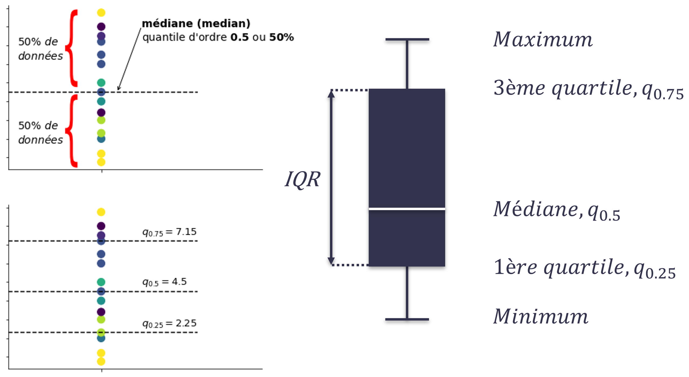
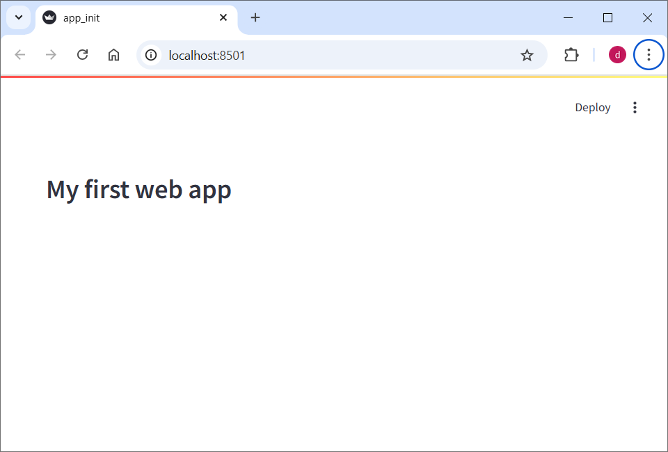

# Statistiques Descriptive et Visualisation de Données avec `streamlit`

## Introduction



<div class="alert alert-block alert-info">
    <b>La population statistique</b> est l'ensemble des <b>individus</b> (personnes ou objets) sur lequels porte l'étude statistique.
</div>

<div class="alert alert-block alert-info">
    Un <b>individu</b> (ou une <b>unité statistique</b>) est chaque élément étudié.
</div>

<div class="alert alert-block alert-info">
    Un <b>caractère</b> est une propriété (qualité) étudiée chez ces individus.
</div>

<div class="alert alert-block alert-info">
    On distingue les caractères selon leur nature : <b>qualitatif</b>, c’est-à-dire nommé par une qualité, un nom propre, etc., ou <b>qantitatif</b>, c’est-à-dire mesurable à l’aide d’un nombre..
</div>

**Séries statistiques simples**


Si on étudie $n$ individus, on obtient alors une **série statistique** de $n$ nombres $x_1, x_2, ..., x_n$.

<div class="alert alert-block alert-info">
Dans le cas discret, différentes valeurs distinctes (états) d’une statistique présentés par les individus sont les <b>modalités</b> d’une variable étudiée (aka caractère étudié / <i>feature</i>) : $(e_i)_{i=1,...,k}$.  
    
Dans le cas continu, ces différentes valuers sont regroupées dans des <b>classes</b>, c'est-à-dire des intervalles de valeurs : $([a_{j-1}, a_j[)_{j=1,...,k}$. 
    
*Remarque* : dans la tradition anglo-saxone, les intervalles considérées sont souvent ouvertes à gauche.
</div>

<div class="alert alert-block alert-info">
<b>Effectif</b> de la modalité $e_i$, noté $n_i$, est le nombre d’occurrences de cette modalité dans la série statistique, c.à.d. le nombre d'individus de modalité égale à $e_i$ (cas discret).
    
<b>Effectif</b> de la classe $[a_{j-1}, a_j[$, noté $n_j$, est le nombre d’observations appartenant à cette classe (cas continu).
</div>

<div class="alert alert-block alert-info">
<b>Effectif cumulé</b> de la modalité $e_i$, noté $N_i$, est le nombre d’individus pour lesquels la valeur du caractère est inférieure ou égale à $e_i$ : $N_i = \sum_{j=1}^{i}n_j$.
</div>

<div class="alert alert-block alert-info">
<b>Fréquence</b> de la modalité $e_i$, notée $f_i$, est le rapport entre l’effectif de cette modalité $n_i$ et l’<i>effectif total</i> $n$ : $f_i = \frac{n_i}{n}$ (cas discret).
    
<b>Fréquence</b> de la classe $[a_{j-1}, a_j[$, notée $f_i$, est le rapport entre l’effectif de cette classe $n_j$ et l’<i>effectif total</i> $n$ (cas continu).    
</div>

<div class="alert alert-block alert-info">
<b>Fréquence cumulée</b> de la modalité $e_i$, noté $F_i$, est le nombre relatif d’individus pour lesquels la valeur du caractère est inférieure ou égale à $e_i$ : $F_i = \sum_{j=1}^{i}f_j$.
</div>

Cas discret :

| Modalités $e_i$ | $e_1$ | $e_2$ | ... | $e_k$ | TOTAL |
| --- | --- | --- | --- | --- | --- |
| **Effectifs** $n_i$ | $n_1$ | $n_2$ | ... | $n_k$ | $$n = \sum_{i=1}^k n_i$$ |
| **Effectifs cumulés** $N_i$ | $N_1$ | $N_2$ | ... | $N_k$ | |
| **Fréquences** $f_i$ | $f_1$ | $f_2$ | ... | $f_k$ | $1\ (100\%)$ |
| **Fréquences cumulées** $F_i$ | $F_1$ | $F_2$ | ... | $F_k$ | |

Cas continu :

| Classes $[a_{i-1}, a_i[$ | $[a_{0}, a_1[$ | $[a_{1}, a_2[$ | ... | $[a_{k-1}, a_k[$ | TOTAL |
| --- | --- | --- | --- | --- | --- |
| **Effectifs** $n_i$ | $n_1$ | $n_2$ | ... | $n_k$ | $$n = \sum_{i=1}^k n_i$$ |
| **Effectifs cumulés** $N_i$ | $N_1$ | $N_2$ | ... | $N_k$ | |
| **Fréquences** $f_i$ | $f_1$ | $f_2$ | ... | $f_k$ | $1\ (100\%)$ |
| **Fréquences cumulées** $F_i$ | $F_1$ | $F_2$ | ... | $F_k$ | |

**Statistiques descriptives de base**

1. La moyenne arithmétique :

$$\bar{X} = \frac{1}{n} \sum_{i=1}^{n}x_i = \frac{1}{n} \sum_{i=1}^{k}n_i e_i$$

2. La médiane (q2), q1 et q3 :

Soit $S_{rangée}$ une série statistique ordonnées, i.e. $x_{(1)} \leq x_{(2)} \leq ... x_{(n)}$.

Médiane :

$$\tilde{q}_{0.5} = \left\{
    \begin{array}{ll}
        x_{((n+1)/2)}  \text{ si } n \text{ est impair}\\
        \frac{x_{(n/2)} + x_{((n+1)/2}}{2}) \text{ sinon}
    \end{array}
\right. 
$$

Quantile de l'ordre $\alpha$ :

$$\tilde{q}_{\alpha} = x_{(m)}+d(x_{(m+1)}-x_{(m)})$$

où $m$ et $d$ sont les parties entière et décimale de $\alpha(n+1)$



$q1$ correspond au quantile de l'ordre $0.25$ et $q3$ au quantile de l'ordre de $0.75$.

3. La variance et l'écart-type :

Variance : 
$$s_n^2 = \frac{1}{n}\sum_{i=1}^{n}(x_i-\bar{x})^2 = \frac{1}{n}\sum_{i=1}^{n}x_i^2 - \bar{x}^2 = \left(\frac{1}{n}\sum_{i=1}^{k}n_ie_i^2\right)-\bar{x}^2$$


Ecart-type :
$$s_n = \sqrt{s_n^2}$$

<div class="alert alert-block alert-info">
Le <b>mode</b> est la valeur du caractère (ou la classe) qui présente l'effectif le plus élevé. Une série statistique peut être <i>unimodale</i> (un seul mode), <i>bimodale</i> (deux modes), <i>plurimodale</i>. (La classe modale est une classe de rapport
fréequence/longueur maximale.)
</div>

<div class="alert alert-block alert-info">
<b>Ecart interquartile</b> (IQR, <i>interquartile range</i>) est la différence entre le troisième et le premier quartile : 
$$IQR = q_3 - q_1$$
</div>

<div class="alert alert-block alert-info">
<b>Coefficient de symétrie (Skewness)</b> : l'asymétrie d'une distribution peut-ëtre camculée à l'aide du coefficient de symétrie. Si la distribution est symétrique ce coefficient est égal à zéro, si la distribution a une queue étalée vers la gauche il est négatif, si la distribution a une queue étalée vers la droite il est positif.

Avec $m_r = \frac{1}{n}\sum_{i=1}^{n}(x_i - \bar{x})^r$ : $$\gamma_1 = \frac{m_3}{m_2^{3/2}}$$
</div>

## Étude de cas : Qualité de l'air en Auvergne-Rhône-Alpes

Chaque année, nous estimons qu'en France plusieurs dizaines de milliers de décès sont dûs à une mauvaise qualité de l'air, et plusieurs millions dans le monde. C'est pourquoi de nombreuses villes étudient et publient un **indice de qualité de l'air** ayant pour but : l'évaluation de la qualité de l'air, l'aide à la décision, et la communication au public. 

En France, pour les agglomérations de plus de 100 000 habitants, l'indice retenu est l'indice ATMO. Il vise à étudier la qualité de l'air en mesurant les concentrations de dioxyde de souffre, dioxyde d'azote, d'ozone, et de particules en suspension ($\textrm{PM}_{10}$ seulement) à l'échelle d'une agglomération ou d'une région.

Nous nous proposons une étude préliminaire de la concentration des particules fines en suspension dans l'air $\textrm{PM}_{10}$ (d'un diamètre inférieur à 10 micromètres) dans la région Auvergne-Rhône-Alpes. Pour ce faire, nous avons téléchargé les données issues de ATMO France : **Indice\_ATMO\_ARA.csv**. Dans ce fichier, nous retrouvons les relevés de concentration correspondantes à la journée du 13 novembre 2023.

## Prise en main de `streamlit`

Nous allons utiliser le framework [`streamlit`](https://streamlit.io/) pour construire des applications web permettant des visualisations et intéractions avec les données.

Afin d'installer ce framework, dans le terminal (ou Anaconda Prompt Shell) exécutez l'instruction suivante :

`pip install streamlit`

Ouvrez maintenant le fichier `app_init.py`. C'est ici que vous allez écrire le code de votre application. 

Afin de lancer l'application, dans le terminal ouvert à partir du dossier *root* du projet, exécutez la commande suivante :

`streamlit run app_init.py`

où `app_init.py` est le nom du fichier à exécuter.

Une nouvelle page va s'ouvrir dans le navigateur :



Faites une modification dans le code, e.g. changer le texte dans ligne :

`st.header("My first web app")`

par le texte *"Qualité de l'air en Auvergne-Rhône-Alpes* et sauvegardez le fichier de code. Maintenant, revenez sur la page dans le navigateur et appuyez sur "*Always rerun*" afin d'appliquer toutes les modifications automatiquement sans avoir besoin de renouveller la page.

Ajoutez un texte markdown en utilisant `st.markdown("some texte")`:

`st.markdown("""Chaque année, nous estimons qu'en France plusieurs dizaines de milliers de décès sont dûs à une mauvaise qualité de l'air, et plusieurs millions dans le monde. C'est pourquoi de nombreuses villes étudient et publient un **indice de qualité de l'air** ayant pour but : l'évaluation de la qualité de l'air, l'aide à la décision, et la communication au public. 
En France, pour les agglomérations de plus de 100 000 habitants, l'indice retenu est l'indice ATMO. Il vise à étudier la qualité de l'air en mesurant les concentrations de dioxyde de souffre SO2, dioxyde d'azote, d'ozone NO2, et de particules en suspension (les particules de diamètre aérodynamique inférieur à 10 micromètres, ${PM}_{10}$ et les particules de diamètre aérodynamique inférieur à 2,5 micromètres $PM2,5$) à l'échelle d'une agglomération ou d'une région. Fréquence de mise à jour : quotidienne à 14H locales. 
Source: [Indice ATMO](https://www.data.gouv.fr/fr/datasets/indice-atmo/#/resources)""")`

## Exercice 1
1. Ecrivez une fonction `load_data(filename='data/Indice_ATMO_ARA.csv')` qui sert à créer un dataframe `pandas` à partir du fichier csv donné comme paramètre. Utilisez le décorateur `@st.cache_data(persist=True)` afin d'éviter de rechargement de données à chaque modification.
```
@st.cache_data(persist=True)
def load_data(filename='data/Indice_ATMO_ARA.csv'):
    """
    Laod the data from a csv file.
    The decorator allows to store the data in cache and avoid reloading it each time a modification is made.
    """
    data = pd.read_csv(filename)
    # Convert datetime column to pandas datetime if not already done
    data['date_dif'] = pd.to_datetime(data['date_dif'])
```

2. Créez un dataframe `data` à partir du fichier proposé. 
3. Récupérez la série des mesures de concentration de PM10 de la colonne `"conc_pm10"` dans une série `pm10`.
4. Ajoutez un checkbox sur un pannel latéral :
`st.sidebar.checkbox("Affichez les données brut", False)`. S'il est coché, alors affichez les données brut dans l'application principale avec `st.write(data)`.

## Exercice 2
1. Déterminer les moyenne, médiane, variance, écart-type, premier et troisième quantile de la série des mesures de concentration de $\textrm{PM}_{10}$. 
2. Comparer les résultats obtenus avec les méthodes de `pandas.dataframe` et `describe()`. 
3. Afficher le résultat avec `streamlit` de la façon suivante :
    * Créer une liste des statistiques possibles : `all_stats = ["count", "moyenne", "écart-type", "variance", "min", "1er quartile", "médiane", "3ème quartile", "max"]`
    * Créer une liste des statistiques choisies par défault : `def_stats = ["moyenne", "écart-type", "médiane"]`
    * Ajouter un multiselect sur le panel latéral : `list_stats_to_show = st.sidebar.multiselect("Statistiques à afficher", options=all_stats, default=def_stats, key='multi-stats')`
    * Garder les statistiques calculés dans un dataframe `stats_to_show`
    * Ajouter un boutton de l'affichage de statistiques : 
    ```
    if st.sidebar.button("Afficher les stats de ${PM}_{10}$"):
        # ajouter votre code
    ```
    * Afficher ce dataframe avec `st.write(stats_to_show)`   
    

*Rappel* : Il est possible de se servir de la méthode [`describe`](https://pandas.pydata.org/pandas-docs/stable/reference/api/pandas.Series.describe.html) afin de récupérer un résumé des statistiques descriptives. Pour accéder à une statistique en particulier, utilisez le nom de la statistique comme clé du dictionnaire, e.g. : `df.describe()['count']`.

Voici le code du dictionaire contenant les clés présentes dans le dictionnaire `describe()`:
```
stats_map = {"count": "count",
            "moyenne": "mean",
            "écart-type": "std",
            "variance": "var",
            "min": "min",
            "1er quartile": "25%",
            "médiane": "50%",
            "3ème quartile": "75%",
            "max": "max"
            }
```

Notons qu'il existe des méthodes de pandas permettant d'effectuer ces calculs :
- moyenne [`mean()`](https://pandas.pydata.org/pandas-docs/stable/reference/api/pandas.Series.mean.html)
- écart-type [`std()`](https://pandas.pydata.org/pandas-docs/stable/reference/api/pandas.Series.std.html)
- variance [`var()`](https://pandas.pydata.org/pandas-docs/stable/reference/api/pandas.Series.var.html)
- médiane [`median()`](https://pandas.pydata.org/pandas-docs/stable/reference/api/pandas.Series.median.html)
- quantile de l'ordre $q$ [`quantile(q)`](https://pandas.pydata.org/pandas-docs/stable/reference/api/pandas.Series.quantile.html)

## Exercice 3
Nous souhaitons de visualiser cette série `pm10` à l'aide de 2 type de graphiques : *boxplot* et *histogramme*.

Afin de permettre l'intéractivité des graphiques, nous allons utiliser la bibliothèque [`plotly.express`](https://plotly.github.io/plotly.py-docs/generated/plotly.express)

1. Ajouter un subheader: `st.sidebar.subheader("Visualisation")`
2. Ajouter un checkbox "Cacher" coché par défaut : s'il est coché, les visualisations et les menus associés sont cachés
3. Ajouter un selectbox `select = st.sidebar.selectbox('Visualisation type', ['Histogram', 'Box Plot'], key='viz')` qui permet de définir quel type de graphique va être afficher, histogramme ou boxplot :
    * si `select == 'Box Plot'`, un [boxplot](https://plotly.github.io/plotly.py-docs/generated/plotly.express.box.html) doit être affiché, i.e. 
    ```
    # create a boxplot
    fig = px.box(df, title="PM10: boxplot")
    # display it
    st.plotly_chart(fig)
    ```
    *  si `select == 'istogram'`, un [histogramme](https://plotly.github.io/plotly.py-docs/generated/plotly.express.histogram.html) doit être affiché, i.e.:
    ```
    # create a histogram
    fig = px.histogram(df, 
                       title="Histogramme concentration pm10", 
                       color_discrete_sequence=['darkcyan'], 
                       opacity=0.75)
    # display it
    st.plotly_chart(fig)
    ```
4. Notons qu'un histogramme peut refléter les fréquences absolues (count) ou relatives. Dans le dernier cas, on parle de densité. Le paramètre qui est responsable de ce type de valeur est `histnorm`. 
Modifier le code de la façon suivante :
    * Si un histogramme est choisi, ajouter un radiobutton donnant le choix de type de valeurs :
    `hist_type = st.sidebar.radio("Type de valeurs", ("count", "probability density"))`
    * Si c'est `"probability density"` qui est choisi, alors le paramètre `histnorm="probability density"` et `None` sinon.
5. Nous souhaitons maintenant d'ajouter une estimation de la fonction de densité si `"probability density"` a été choisie.
Pour cela, ajouter une fonction suivante:

```
def add_density(fig, df):
    # Calculate the KDE
    kde_x = np.linspace(df.min(), df.max(), 100)
    kde = stats.gaussian_kde(df)
    kde_y = kde(kde_x)
                
    # Add the KDE as a line trace
    fig.add_traces(
                    go.Scatter(
                        x=kde_x, 
                        y=kde_y,
                        name='Density',
                        line=dict(color='red', width=2)
                    )
    )
    
    return fig
```

Appelez cette fonction après la création de l'histogramme et avant son affichage.

## Exercice 4
Selon la législation française, le seuil moyen annuel de concentration de particules $\textrm{PM}_{10}$ à ne pas dépasser est fixé à $40 \mu g.m^{-3}$. Nous allons étudier le dapassement des seuils. 

1. Ajouter un slider sur le panel latéral :
`thres = st.sidebar.slider("Seuil à ne pas dépasser", min_value=10, max_value=100, value=40)`
Cette valeur va être le seuil étudié.
2. Nous allons ajouter 2 dates qui définisse la période de temps de données à considérée :
    * calculer la date min et la date max contenues dans la colonne `"date_dif"` 
    * Ajouter deux date_input:
    ```
    # Add date picker to sidebar
    start_date = st.sidebar.date_input(
        "Start date",
        value=min_date,  # default value
        min_value=min_date,  
        max_value=max_date
    )
    
    # Add date picker to sidebar
    end_date = st.sidebar.date_input(
        "End date",
        value=max_date,  # default value
        min_value=min_date,  
        max_value=max_date
    )
    ```
    * Filtrer les données pour que la date `"date_dif"` soit comprise entre les deux dates sélectionnées et que la concentration de PM10 soit supérieur au seuil défini.
    * Afficher le résultat après l'appuie de bouton `st.sidebar.button("Afficher le résultat")`.
3. V2rifier le résultat pour le seuil 40 et 20.

## Exercice 5
Nous souhaitons maintenant de pouvoir comparer la distribution de PM10 dans 2 zones, e.g. lyonnaise et grenobloise. 

Dans notre étude, nous définissons la région lyonnaise comme l'ensemble des villes Lyon, Villeurbanne, Feyzin et Vénissieux ; et la région grenobloise comme l'ensemble des villes Grenoble, Gières, Meylan, Eybens et Fontaine.

1. Créer une liste de toutes les villes unqiues contenues dans la colonnes `"lib_zone"`. 
*Attention :* pensez à supprimer les vameur vide avec [`dropna()`](https://pandas.pydata.org/docs/reference/api/pandas.DataFrame.dropna.html)
2. Créer deux listes `list_lyon` et `list_grenoble` contenant les villes de cez zones.
3. Ajouter deux multiselect qui prennent comme options la liste de toutes les villes et comme options par défaut `list_lyon` et `list_grenoble` respectivement.
4. Ajouter deux champs de saisie de texte pour définir les noms de ces zones, e.g. `zone_1_txt = st.sidebar.text_input("Nom de la zone", key="txt1")`
5. Filtrer les données en fonction des zones. Créer 2 dataframes correspondants. Garder les colonnes suivantes : `["X", "Y", "lib_zone", "conc_pm10"]`.
6. Ajouter une colonne `area` qui contient la valeur issue du champs de texte. Faite cela pour chaque dataframe.
6. Concatener ces deux dataframes :
```
conca_pm10 = pd.concat([data_zone_1, data_zone_2])
conca_pm10 = conca_pm10.reset_index()
```
7. Ajouter un boxplot qui contient les distributions par zone:
`fig = px.box(conca_pm10, x='area', y='conc_pm10')`
8. Ajouter une visualisation sur la carte:
```
map = px.scatter_mapbox(
                conca_pm10,
                lat='Y',  #  latitude column name
                lon='X',  #  longitude column name
                color='area',    # color points by area
                hover_name='lib_zone',  # city names on hover
                mapbox_style='carto-positron',  # or 'open-street-map', 'stamen-terrain'
                zoom=10
            )
            
# Center the map on your data
map.update_layout(
                mapbox=dict(
                    center=dict(
                        lat=conca_pm10['Y'].mean(),
                        lon=conca_pm10['X'].mean()
                    )
                )
            )

st.plotly_chart(map)
```

## Exercice 6
Calculer le coefficient de corrélation entre la concentration des particules $\textrm{PM}_{10}$ et la concentration d'ozone $O_3$ dans la région lyonnaise. Commenter.

1. Nous récupérerons tout d'abord dans un DataFrame pandas les concentrations de des particules $\textrm{PM}_{10}$ et $\textrm{O}_3$ des villes (*lib_zone*) des villes de Lyon, Villeurbanne, Feyzin et Vénissieux. Il s'agit des colonnes `"conc_o3", "conc_pm10"`
2. Nous calculons la corrélation avec la méthode [`corr()`](https://pandas.pydata.org/docs/reference/api/pandas.DataFrame.corr.html)
3. Le calcul doit s'effectuer à l'appui d'un boutton.
4. Ajouter une visualisation sous forme d'un *heatmap* en appelant la fonction suivante :
```
def plot_heatmap(corr):
    # Plot heatmap
    fig = px.imshow(
        corr, 
        color_continuous_scale='RdBu_r',  # Red-Blue scale
        aspect='auto'
        )
        
    # Add text annotations:
    for i in range(len(corr.columns)):
            for j in range(len(corr.index)):
                fig.add_annotation(
                    x=i, y=j,
                    text=str(round(corr.iloc[j, i], 2)),
                    showarrow=False
            )
       
    st.plotly_chart(fig)
```

## Exercice 7
Nous allons construire un modèle de regréssion linéaire et afficher les résultats. 

```
def calc_linear(df, x_col='conc_o3', y_col='conc_pm10'):
    # Calculate linear regression
    slope, intercept, r_value, p_value, std_err = stats.linregress(df[x_col], df[y_col])

    # Create line points
    x_range = np.linspace(df[x_col].min(), df[x_col].max(), 100)
    y_pred = slope * x_range + intercept
    
    # Create scatter plot with original data
    fig = px.scatter(
        df, 
        x=x_col, 
        y=y_col,
        title=f'Linear Regression (R² = {r_value**2:.3f})'
    )
    
    # Add regression line
    fig.add_scatter(
        x=x_range,
        y=y_pred,
        mode='lines',
        name=f'y = {slope:.2f}x + {intercept:.2f}',
        line=dict(color='red')
    )
    
    # display
    st.plotly_chart(fig)
```